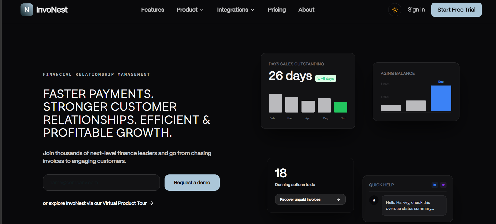
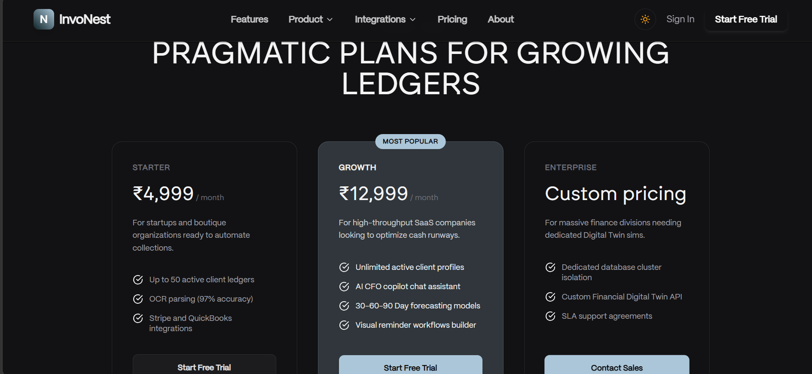
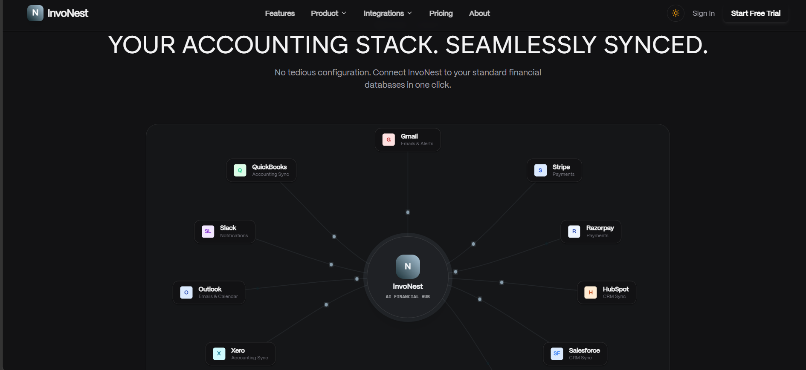
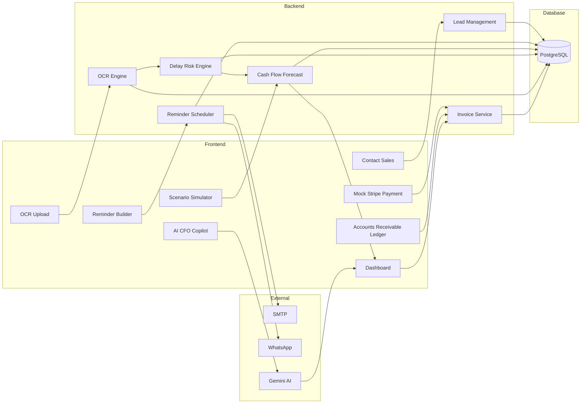

# InvoNest ⚡

**InvoNest** is an AI-powered Accounts Receivable (A/R) lifecycle platform built to help finance teams automate invoice collections, monitor customer payment behavior, predict cash flow risks, and improve working capital. The platform combines OCR-powered invoice digitization, AI-driven risk scoring, financial forecasting, and automated reminder workflows into a single intelligent finance workspace.


---

## 📑 Table of Contents

- [Overview](#overview)
- [Problem Statement](#problem-statement)
- [Solution](#solution)
- [Screenshots](#-screenshots)
- [Key Features](#-key-features)
- [System Architecture](#-system-architecture)
- [Technology Stack](#-technology-stack)
- [Application Workflow](#-application-workflow)
- [API Endpoints](#-api-endpoints)
- [Project Structure](#-project-structure)
- [Installation](#-installation)
- [Deployment](#-deployment)
- [Future Enhancements](#-future-enhancements)
- [License](#-license)

---

# Overview

Managing outstanding invoices is one of the biggest operational challenges for finance teams. Businesses often struggle with delayed customer payments, fragmented invoice records, manual reminder processes, and poor cash flow visibility.

InvoNest centralizes the complete Accounts Receivable lifecycle into a unified dashboard where finance teams can upload invoices, monitor payment statuses, predict collection risks, automate reminders, and simulate future financial outcomes.

---

# Problem Statement

Traditional invoice collection systems suffer from:

- Manual invoice entry
- Lack of payment visibility
- Delayed collections
- No intelligent risk prediction
- Poor cash flow forecasting
- Manual follow-up emails
- Multiple disconnected finance tools

---

# Solution

InvoNest provides a centralized AI-powered finance workspace featuring:

- OCR Invoice Processing
- Accounts Receivable Ledger
- AI CFO Copilot
- Delay Risk Prediction
- Financial Digital Twin Simulator
- Automated Reminder Workflows
- Payment Tracking
- Interactive Analytics Dashboard

---

# 📸 Screenshots

<table>
  <tr>
    <td align="center">
      
      <br/>
      <sub><b>Landing Page</b></sub>
    </td>
    <td align="center">
      
      <br/>
      <sub><b>Platform in Action</b></sub>
    </td>
  </tr>

  <tr>
    <td align="center">
      
      <br/>
      <sub><b>Pricing Plans</b></sub>
    </td>
    <td align="center">
      
      <br/>
      <sub><b>Book Live Demo</b></sub>
    </td>
  </tr>

  <tr>
    <td align="center">
      
      <br/>
      <sub><b>Accounts Receivable Ledger</b></sub>
    </td>
    <td align="center">
      
      <br/>
      <sub><b>Integrations Hub</b></sub>
    </td>
  </tr>
</table>

---

# 🚀 Key Features

## AI Invoice OCR

- Upload PDF, PNG, and JPG invoices
- Automatically extracts:
  - Invoice Number
  - Client Name
  - Invoice Date
  - Due Date
  - Amount
- Automatically inserts invoices into the ledger

---

## Accounts Receivable Ledger

Manage the complete invoice lifecycle.

Supported statuses:

- Draft
- Sent
- Viewed
- Due
- Overdue
- Paid
- Cancelled

Track:

- Outstanding invoices
- Due invoices
- Recovery status
- Delay risk
- Client balances

---

## AI CFO Copilot

Ask questions like:

- Which invoices are most at risk?
- Can we afford another employee?
- What is our projected cash flow?
- Which customers should be contacted first?
- How much money is expected this month?

---

## Delay Risk Prediction

AI-powered payment behavior analysis.

Provides:

- Delay Risk %
- Customer ranking
- Recovery priority
- Recommended follow-up actions

---

## Financial Digital Twin

Run business simulations such as:

- Customer payment delays
- Hiring employees
- Revenue changes
- Payroll increases
- Operating expense growth

Forecast:

- Cash runway
- Working capital
- Monthly cash flow
- Collection timeline

---

## Reminder Automation

Automatically schedule:

- Email reminders
- WhatsApp reminders

Supports multiple reminder stages before and after due dates.

---

## Mock Payment Gateway

Demonstrates a Stripe-like payment workflow.

Features:

- Mock payment confirmation
- Automatic invoice settlement
- Dashboard metric updates
- Ledger synchronization

---

## Contact Sales

Enterprise lead management including:

- Demo requests
- Company information
- Business requirements
- Lead storage

---

## Integrations Hub

Supports integration with:

- Stripe
- Razorpay
- QuickBooks
- Xero
- Gmail
- Outlook
- HubSpot
- Slack

---

# 🏛️ System Architecture



---

# 🛠 Technology Stack

## Frontend

- Next.js
- React
- TypeScript
- Tailwind CSS
- Framer Motion
- Lucide React

## Backend

- NestJS
- Express.js
- Node.js

## Database

- PostgreSQL
- Prisma ORM

## AI & Automation

- Google Gemini API
- OCR Engine
- Nodemailer
- WhatsApp API (Mock)

---

# 🔄 Application Workflow

```text
Invoice Upload
      │
      ▼
OCR Processing
      │
      ▼
Invoice Parsed
      │
      ▼
Stored in PostgreSQL
      │
      ▼
Delay Risk Prediction
      │
      ▼
Accounts Receivable Ledger
      │
      ▼
AI CFO Analysis
      │
      ▼
Reminder Automation
      │
      ▼
Payment Received
      │
      ▼
Invoice Marked as Paid
```

---

# 📡 API Endpoints

| Method | Endpoint | Description |
|---------|----------|-------------|
| POST | `/api/invoices/upload` | Upload invoice |
| GET | `/api/invoices` | Retrieve invoices |
| PATCH | `/api/invoices/:id/status` | Update invoice status |
| GET | `/api/risk` | Get delay risk analysis |
| POST | `/api/copilot/chat` | AI CFO chat |
| POST | `/api/scenario/simulate` | Run financial simulation |
| POST | `/api/reminders/send` | Trigger reminders |
| POST | `/api/payment/mock` | Mock payment |
| POST | `/api/contact-sales` | Submit sales enquiry |

---

# 📂 Project Structure

```text
InvoNest
│
├── frontend
│   ├── app
│   ├── components
│   ├── hooks
│   ├── lib
│   └── public
│
├── backend
│   ├── controllers
│   ├── routes
│   ├── services
│   ├── middleware
│   ├── prisma
│   └── utils
│
├── database
│   └── PostgreSQL
│
└── README.md
```

---

# 💻 Installation

## Prerequisites

- Node.js 18+
- PostgreSQL
- npm

## Clone Repository

```bash
git clone https://github.com/your-username/InvoNest.git

cd InvoNest
```

## Install Dependencies

```bash
npm install
```

## Configure Environment

```env
DATABASE_URL=
GEMINI_API_KEY=
JWT_SECRET=
PORT=3001
```

## Start Development

```bash
npm run dev
```

---

# 🚀 Deployment

## Frontend

- Vercel

## Backend

- Railway
- Render

## Database

- PostgreSQL
- Supabase

---

# 🔮 Future Enhancements

- Stripe Checkout Integration
- Razorpay Integration
- QuickBooks Sync
- Multi-tenant Workspaces
- Team Roles & Permissions
- AI Collections Agent
- Voice-enabled CFO Assistant
- Multi-currency Support
- Predictive Machine Learning Models

---

# 📄 License

This project is licensed under the **MIT License**
